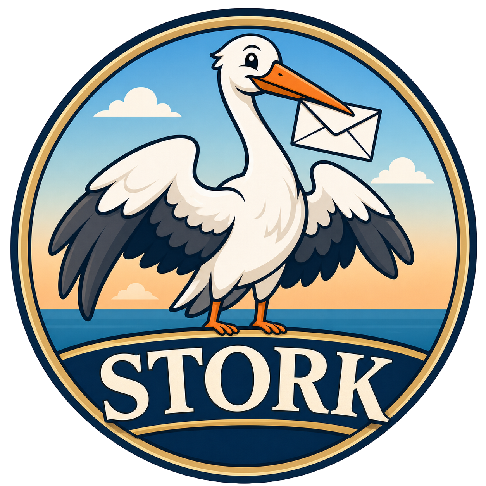

<p align="center">
  
</p>

<p align="center">
  <strong>The ultimate local SMTP catch-all tool for developers.</strong>
</p>

<p align="center">
  
  
  
</p>

---

## ⚡ About

**Stork** is a high-performance local SMTP server and desktop application designed to intercept, inspect, and debug outgoing emails during development. Built with a robust Go backend and a slick React frontend, it gives you a seamless native dashboard to manage your mail traffic without ever hitting a real mail server.

## 🛠️ Tech Stack

* **Backend:** Go (Golang) - Lightning-fast SMTP protocol handling and local server logic.
* **Frontend:** React & TypeScript - Clean, modern, and reactive UI dashboard.

## ✨ Features

* **Catch-All SMTP Server:** Capture every outgoing email from your local applications effortlessly.
* **Real-Time Inspection:** View headers, body text, and payloads instantly.
* **Zero External Config:** Standalone desktop app that runs locally out of the box.

## 🚀 Quick Start

1. Clone the repository:
   ```bash
   git clone https://github.com/your-username/stork.git
   cd stork
